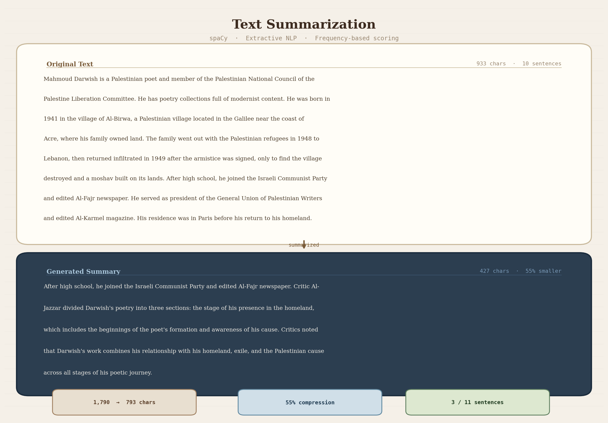
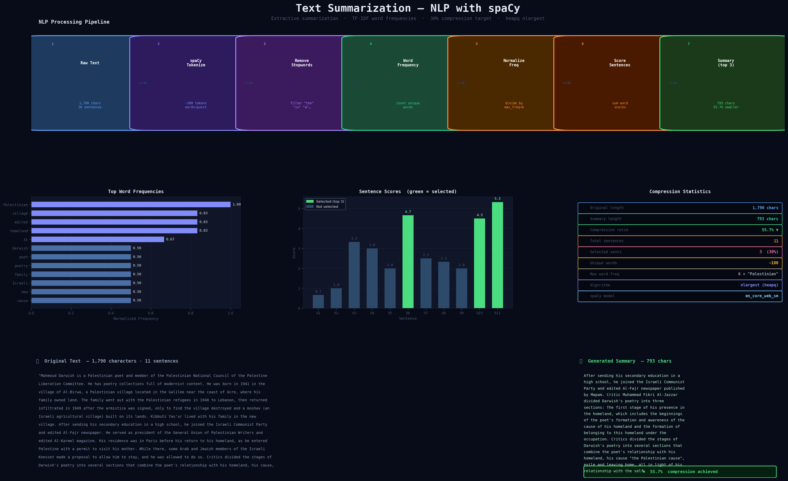

# Text Summarization App

A Python-based Natural Language Processing (NLP) project that automatically generates concise summaries from long text documents using text analysis techniques.

---

##  Overview

The Text Summarization App reduces large amounts of text into shorter, meaningful summaries while preserving the core information.

Text summarization is the process of condensing a document into a shorter version that retains its key ideas and meaning.

This project demonstrates:

-  Natural Language Processing (NLP)  
-  Text preprocessing and analysis  
-  Extractive summarization techniques  
-  Automation of human-like text understanding  

---

## ✨ Features

-  Input large text documents  
-  Generate concise summaries  
-  Extract important sentences  
-  Fast and automated processing  
-  Based on NLP techniques  

---

##  Tech Stack

- Python  
- NLP Libraries (NLTK / spaCy / Gensim)  
- Text Processing Techniques  

---

##  Screenshots

### 🔹 Input / Processing


### 🔹 Output Summary


---

##  Getting Started

### Prerequisites
- Python 3.x  
- Required libraries  

### Installation

```bash
git clone https://github.com/AliSayed15/text_summerization.git
cd text_summerization
pip install -r requirements.txt
python main.py
